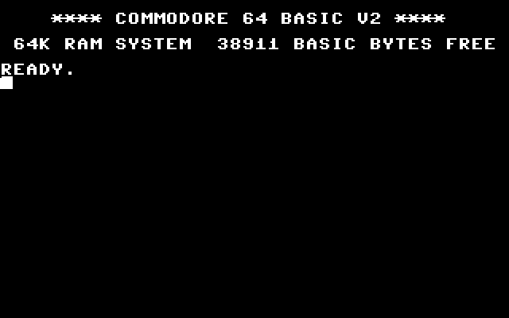
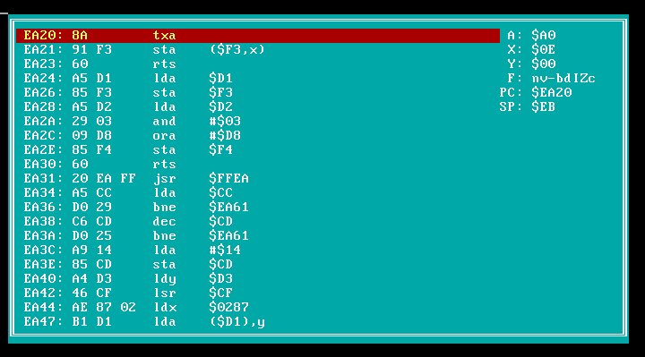

# Commodore 64 emulator

C64EMU is Commodore 64 emulator I wrote in 1999. It is coded 100% 80386+ assembly, which seemed quited necessary then as computers surely weren't as fast as they are now.

The 6510 CPU emulator seems functional enough, as the emulator is able to make it to the BASIC interpreter. There's also an integrated debugger which can single-step and a disassembler which was used to figure out how the ROMs worked. However, all other systems aren't in such a good shape and should be considered stubs; especially the keyboard doesn't work at all as I didn't understood how the keyboard hardware was supposed to work. As other projects crept up, I never properly finished it.

## Screenshot

## Downloads

   * [Source and executables](releases/c64emu-20110822.zip) (66KB)
